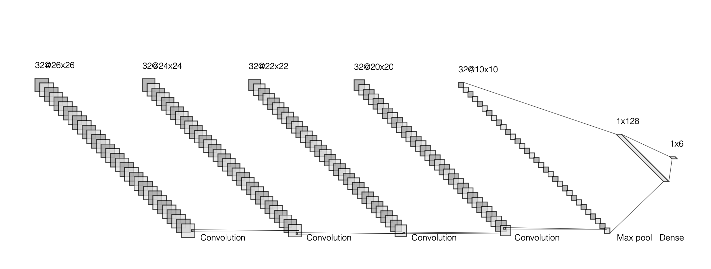

# Finger-Counter
A program to count the number of fingers you're holding out.

# Getting Started

Simply run counter.py or tracker-counter.py. 
tracker.py is less volatile than tracker-counter.py,
but the latter is able to track the location of your hand.

# Single Shot Detector + ConvNet
tracker-counter.py

This archetectire was heavily inspired by MrEliptik's HandPose model (https://github.com/MrEliptik/HandPose). I also used the SSD he trained.

A trained Single Shot Detector model detects your hand and draws a bounding box around it. An image is cropped and fed into a convolutional neural network. Works best with the cnn.h5 weights.

Works best against a white wall in a well lit area.

# ConvNet
counter.py

This one is pretty simple. There's a green box and whatever 
is in it is fed into a convolutional neural network. Works best with the cnn2.h5 weights. 

# Architecture
The ConvNet architecture is pretty straightforward. . I achieved it through lots and lots of trail and error. 

Single Shot Detector (https://arxiv.org/pdf/1512.02325.pdf) is a bit more complicated. 

#ToDo
- fine-tune ConvNet a bit more
- train ssd on more data