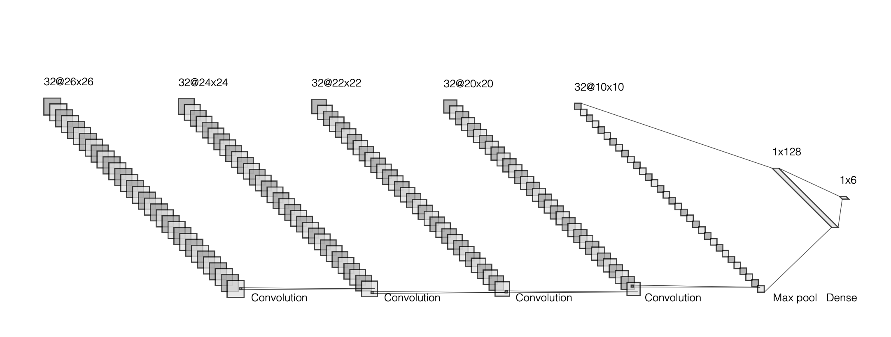
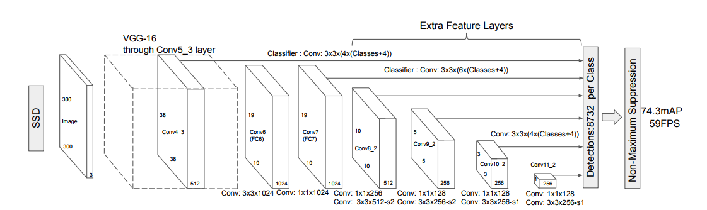

# Finger-Counter
A program to count the number of fingers you're holding out.

# Getting Started

Simply run counter.py or tracker-counter.py. 
tracker.py is less volatile than tracker-counter.py,
but the latter is able to track the location of your hand.

# ConvNet
counter.py

This one is pretty simple. There's a green box and whatever 
is in it is fed into a ConvNet. 

Works best with the cnn2.h5 weights, and against a white wall in a well lit area. 

# Single Shot Detector (SSD) + ConvNet
tracker-counter.py

This architectire was heavily inspired by MrEliptik's HandPose model (https://github.com/MrEliptik/HandPose). I also used the SSD he trained.

A trained SSD detects and places a min-area bounding box around your hand. An image is cropped from it and fed into a ConvNet. 

Works best with the cnn.h5 weights, and in a well lit area. 

# Architecture
The ConvNet architecture is pretty straightforward, and was achieved through lots and lots of trail and error. 

Single Shot Detector (https://arxiv.org/pdf/1512.02325.pdf) is a bit more complicated.  It's quite fascinating how the SSD works. Long story short, the model detects 100 boxes, each box having its own probability distribution of all the classes. And every box has a score that something is in it (since most of the bounding boxes will contain nothing). The box with the highest score and a score above a chosen threshold (I chose .2) is chosen as the output box. Andrew Ng has a good video on it (https://www.youtube.com/watch?v=gKreZOUi-O0).

# ToDo
- fine-tune ConvNet a bit more
- train ssd on more data